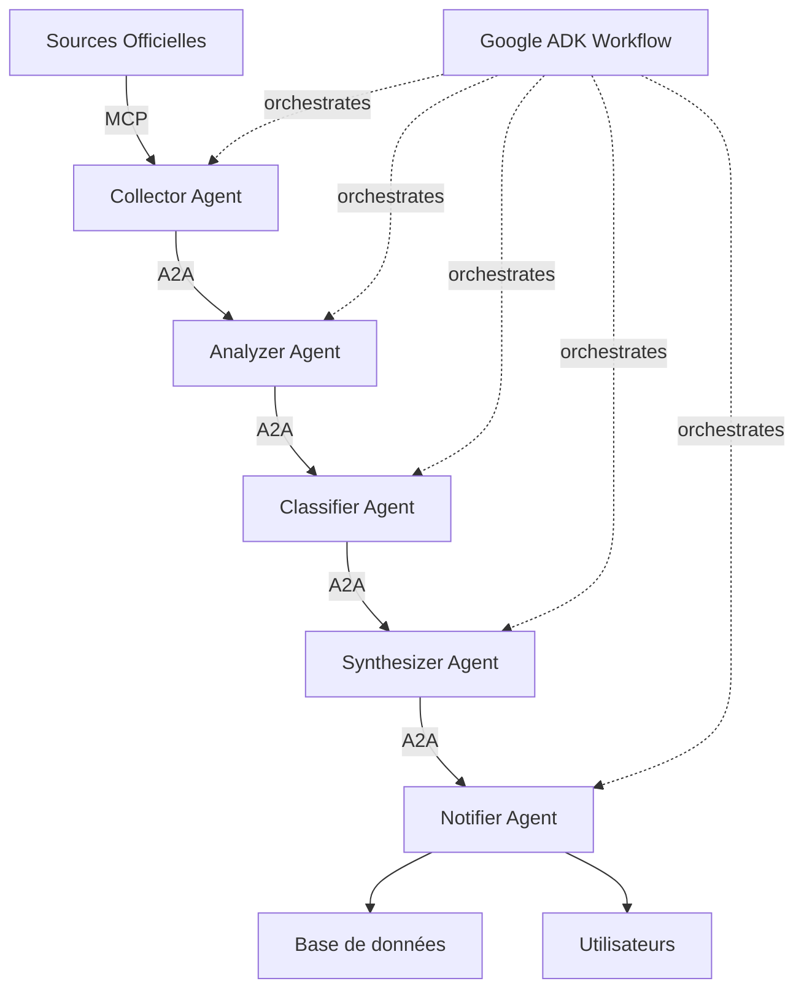

# 🔄 REFONTE COMPLÈTE - MODULE VEILLE RÉGLEMENTAIRE

## 📋 RÉSUMÉ EXÉCUTIF

Refonte complète du module de veille réglementaire avec intégration de:
- **Google ADK** - Orchestration d'agents IA
- **A2A Protocol** - Communication inter-agents
- **MCP (Model Context Protocol)** - Connexion aux sources de données

## 🎯 OBJECTIFS

1. **Veille automatisée rigoureuse** sur sources officielles
2. **Analyse intelligente** par agents IA spécialisés
3. **Pertinence maximale** avec filtrage IA avancé
4. **Sources officielles prioritaires** (EUR-Lex, Commission UE, autorités nationales)

---

## 🏗️ ARCHITECTURE MULTI-AGENTS

### 1️⃣ Agent Collecteur (Data Collector Agent)
**Rôle:** Collecte automatisée depuis sources officielles

**Sources primaires:**
- EUR-Lex API (législation UE)
- Commission Européenne - AI Office
- CNIL (France)
- DGCCRF (France)
- EDPB (European Data Protection Board)
- Autorités nationales IA (par pays)

**Technologies:**
- MCP Server pour chaque source officielle
- Web scraping intelligent (Puppeteer/Playwright)
- API REST officielles
- RSS/Atom feeds
- Webhooks officiels

**Outputs:**
```typescript
interface RawRegulatoryData {
  source: OfficialSource;
  url: string;
  title: string;
  rawContent: string;
  publishedDate: Date;
  documentType: 'regulation' | 'directive' | 'decision' | 'guidance' | 'consultation';
  metadata: Record<string, any>;
}
```

---

### 2️⃣ Agent Analyseur (Analysis Agent)
**Rôle:** Évaluation de pertinence et criticité

**Capacités:**
- Analyse sémantique du contenu
- Détection de mots-clés réglementaires IA Act
- Évaluation de l'impact (haut/moyen/faible)
- Classification par catégorie (obligations, sanctions, normes, etc.)

**Modèle LLM:**
- Gemini 2.0 Flash (via ADK) pour analyse rapide
- Claude 3.7 Sonnet pour analyses complexes (via MCP)

**Outputs:**
```typescript
interface AnalyzedUpdate {
  relevanceScore: number; // 0-100
  aiActRelevance: boolean;
  impactLevel: 'critical' | 'high' | 'medium' | 'low';
  affectedStakeholders: string[];
  keyTopics: string[];
  deadlines: Date[];
  actionRequired: boolean;
}
```

---

### 3️⃣ Agent Classificateur (Classification Agent)
**Rôle:** Catégorisation fine et enrichissement

**Classifications:**
- Type de mise à jour (amendement, acte délégué, guidance, FAQ, etc.)
- Domaines impactés (Annexe III, modèles GPAI, transparence, etc.)
- Acteurs concernés (fournisseurs, déployeurs, autorités, etc.)
- Urgence temporelle (immédiat, 6 mois, 1 an, etc.)

**Enrichissement:**
- Extraction d'entités (dates, articles, annexes)
- Liens vers articles AI Act concernés
- Identification de changements normatifs
- Détection de contradictions avec texte existant

---

### 4️⃣ Agent Synthétiseur (Synthesis Agent)
**Rôle:** Génération de résumés et insights

**Capacités:**
- Résumé exécutif (3-5 lignes)
- Points clés structurés
- Implications pratiques
- Recommandations d'action
- Génération de checklist de conformité

**Format de sortie:**
```typescript
interface RegulatoryInsight {
  executiveSummary: string;
  keyPoints: string[];
  practicalImplications: string[];
  recommendedActions: Action[];
  complianceChecklist: ChecklistItem[];
  relatedArticles: string[];
}
```

---

### 5️⃣ Agent Notificateur (Notification Agent)
**Rôle:** Alertes intelligentes et personnalisées

**Capacités:**
- Profil utilisateur (industrie, rôle, risques)
- Filtrage personnalisé par pertinence
- Priorisation des alertes
- Multi-canal (email, in-app, webhook)
- Digest quotidien/hebdomadaire

---

## 🔗 INTÉGRATION DES PROTOCOLES

### MCP (Model Context Protocol)

**MCP Servers à créer:**

1. **EUR-Lex MCP Server**
```typescript
// server/mcp-servers/eurlex-server.ts
{
  name: "eurlex-ai-act-monitor",
  version: "1.0.0",
  capabilities: {
    resources: true,
    tools: true
  },
  tools: [
    {
      name: "search_eurlex",
      description: "Search EUR-Lex for AI Act related documents",
      inputSchema: { query: string, dateFrom: Date }
    },
    {
      name: "fetch_document",
      description: "Fetch full legal document from EUR-Lex",
      inputSchema: { celex: string }
    }
  ]
}
```

2. **Commission Européenne MCP Server**
```typescript
// server/mcp-servers/ec-aioffice-server.ts
{
  name: "ec-ai-office-monitor",
  tools: [
    {
      name: "get_ai_office_updates",
      description: "Fetch latest updates from EC AI Office"
    },
    {
      name: "get_codes_of_conduct",
      description: "Retrieve AI codes of conduct"
    }
  ]
}
```

3. **CNIL MCP Server**
```typescript
// server/mcp-servers/cnil-server.ts
{
  name: "cnil-ai-monitor",
  tools: [
    {
      name: "get_cnil_recommendations",
      description: "Fetch CNIL AI and GDPR recommendations"
    }
  ]
}
```

---

### A2A (Agent-to-Agent Protocol)

**Agent Cards (JSON):**

```json
{
  "agent_id": "regulatory-collector-001",
  "name": "EU AI Act Data Collector",
  "description": "Collects regulatory updates from official EU and national sources",
  "capabilities": [
    {
      "action": "collect_eurlex_updates",
      "input_schema": { "dateFrom": "string", "topics": "array" },
      "output_schema": { "updates": "array" }
    },
    {
      "action": "monitor_ai_office",
      "input_schema": { "checkInterval": "number" },
      "output_schema": { "newDocuments": "array" }
    }
  ],
  "communication": {
    "protocols": ["http", "sse", "webhook"],
    "formats": ["json", "xml"]
  }
}
```

**Agent Communication Flow (A2A):**

```
┌─────────────────┐
│  Collector      │───┐
│  Agent          │   │
└─────────────────┘   │
                      │ A2A Protocol
┌─────────────────┐   │ (Agent Cards)
│  Analyzer       │◄──┤
│  Agent          │   │
└─────────────────┘   │
         │            │
         ├────────────┤
         ▼            │
┌─────────────────┐   │
│  Classifier     │◄──┘
│  Agent          │
└─────────────────┘
         │
         ▼
┌─────────────────┐
│  Synthesizer    │
│  Agent          │
└─────────────────┘
         │
         ▼
┌─────────────────┐
│  Notifier       │
│  Agent          │
└─────────────────┘
```

---

### Google ADK Integration

**Agent Workflow avec ADK:**

```typescript
// server/agents/regulatory-monitoring-workflow.ts
import { WorkflowAgent, LLMAgent } from '@google-cloud/adk';

// Workflow principal
const regulatoryWorkflow = new WorkflowAgent({
  name: 'regulatory-monitoring-workflow',
  type: 'sequential',
  agents: [
    collectorAgent,
    analyzerAgent,
    classifierAgent,
    synthesizerAgent,
    notifierAgent
  ]
});

// Agent LLM pour analyse
const analyzerAgent = new LLMAgent({
  model: 'gemini-2.0-flash',
  systemPrompt: `Tu es un expert en réglementation IA européenne.
  Analyse les documents réglementaires et évalue:
  - Pertinence pour l'AI Act
  - Criticité (critique/important/info)
  - Impact sur les stakeholders
  - Délais et obligations`,
  tools: [
    { name: 'extract_entities', function: extractEntitiesFromDocument },
    { name: 'assess_impact', function: assessRegulatoryImpact }
  ]
});

// Agent de synthèse
const synthesizerAgent = new LLMAgent({
  model: 'claude-3-7-sonnet',
  systemPrompt: `Génère des résumés exécutifs et insights actionnables
  pour les professionnels de la conformité IA.`,
  tools: [
    { name: 'generate_summary', function: generateExecutiveSummary },
    { name: 'create_checklist', function: createComplianceChecklist }
  ]
});
```

---

## 📡 SOURCES OFFICIELLES PRIORITAIRES

### 1. Sources Européennes

| Source | Type | Fréquence | Méthode |
|--------|------|-----------|---------|
| EUR-Lex | API REST | Quotidienne | MCP Server |
| AI Office (EC) | Web Scraping | Quotidienne | Puppeteer + MCP |
| EDPB | RSS Feed | Quotidienne | MCP Server |
| EU AI Board | Webhook | Temps réel | A2A Event |

### 2. Sources Nationales France

| Source | Type | Fréquence | Méthode |
|--------|------|-----------|---------|
| CNIL | API + RSS | Quotidienne | MCP Server |
| DGCCRF | Web Scraping | Quotidienne | Puppeteer |
| Légifrance | API | Quotidienne | MCP Server |

### 3. Sources Internationales

| Source | Type | Fréquence | Méthode |
|--------|------|-----------|---------|
| NIST AI RMF | RSS | Hebdomadaire | MCP Server |
| ISO/IEC JTC 1 | Web | Hebdomadaire | Scraping |
| OECD AI | RSS | Hebdomadaire | MCP Server |

---

## 🔧 STACK TECHNIQUE

### Backend
- **Node.js / TypeScript** - Runtime
- **Google ADK** - Agent orchestration
- **MCP SDK** - Protocol implementation
- **A2A SDK** - Agent communication
- **Puppeteer** - Web scraping
- **Bull/BullMQ** - Job queue
- **Redis** - Cache & pub/sub
- **PostgreSQL** - Stockage structuré
- **Vector DB (Pinecone/Weaviate)** - Recherche sémantique

### AI/ML
- **Gemini 2.0 Flash** - Analyse rapide
- **Claude 3.7 Sonnet** - Analyse complexe
- **Embedding Models** - Similarité sémantique
- **LangChain** - Orchestration LLM

### Infrastructure
- **Docker** - Containerisation
- **Kubernetes** - Orchestration (prod)
- **Cloud Run** - Déploiement ADK agents
- **GitHub Actions** - CI/CD

---

## 📊 FLUX DE DONNÉES



---

## 🚀 PLAN D'IMPLÉMENTATION

### Phase 1: Infrastructure (Semaine 1-2)
- [ ] Setup Google ADK project
- [ ] Implémenter MCP servers (EUR-Lex, CNIL, EC)
- [ ] Créer Agent Cards (A2A)
- [ ] Configurer Redis & PostgreSQL

### Phase 2: Agents Core (Semaine 3-4)
- [ ] Développer Collector Agent
- [ ] Développer Analyzer Agent
- [ ] Développer Classifier Agent
- [ ] Tests d'intégration A2A

### Phase 3: Intelligence (Semaine 5-6)
- [ ] Développer Synthesizer Agent
- [ ] Développer Notifier Agent
- [ ] Intégrer Vector DB pour recherche sémantique
- [ ] Fine-tuning prompts

### Phase 4: Monitoring & UI (Semaine 7-8)
- [ ] Dashboard temps réel
- [ ] Alertes personnalisées
- [ ] Métriques de qualité
- [ ] Documentation utilisateur

---

## 🔐 SÉCURITÉ & CONFORMITÉ

### MCP Security
- Authentication par API keys
- Rate limiting par source
- Validation des données entrantes
- Audit logging

### A2A Security
- Agent authentication (OAuth 2.0)
- Message signing (JWT)
- Encrypted communication (TLS)
- Agent capability verification

### Data Privacy
- RGPD compliance
- Données anonymisées
- Retention policies
- Right to erasure

---

## 📈 MÉTRIQUES DE SUCCÈS

### Quantitatives
- **Couverture:** >95% des sources officielles
- **Latence:** <30 min détection → notification
- **Précision:** >90% pertinence des alertes
- **Disponibilité:** 99.9% uptime

### Qualitatives
- Satisfaction utilisateur
- Réduction du temps de veille manuelle
- Amélioration de la conformité proactive
- Qualité des insights générés

---

## 💡 INNOVATIONS CLÉS

1. **Multi-Agent Intelligence:** Spécialisation par tâche
2. **Source Officielle Only:** Fiabilité maximale
3. **Real-time Processing:** Alertes immédiates
4. **Semantic Analysis:** Compréhension contextuelle
5. **Personalization:** Filtrage par profil utilisateur
6. **Actionable Insights:** Recommandations concrètes

---

## 📚 RÉFÉRENCES

- [Google ADK Docs](https://google.github.io/adk-docs/)
- [A2A Protocol Spec](https://a2aprotocol.ai/)
- [MCP Documentation](https://github.com/modelcontextprotocol)
- [EUR-Lex API](https://eur-lex.europa.eu/content/help/data-reuse/webservice.html)
- [AI Act Official Text](https://eur-lex.europa.eu/legal-content/EN/TXT/?uri=CELEX:32024R1689)

---

**Prêt pour implémentation complète.**
